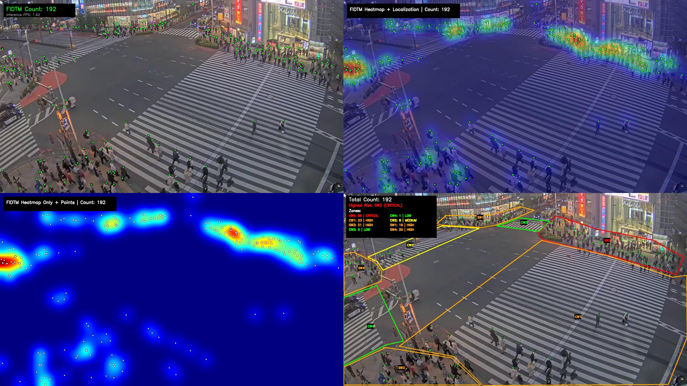
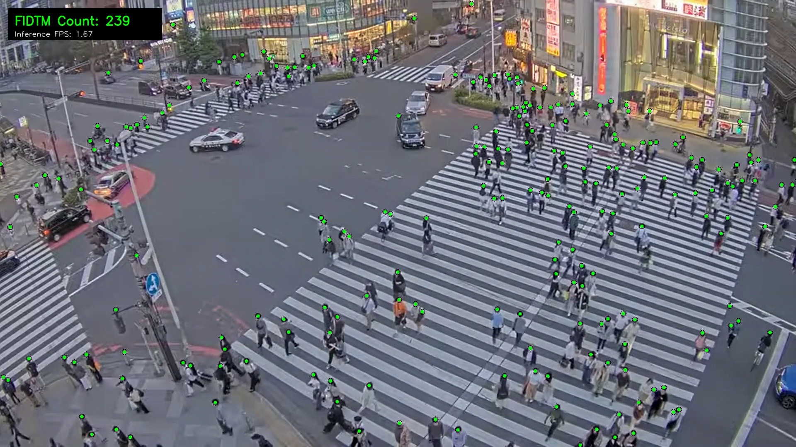
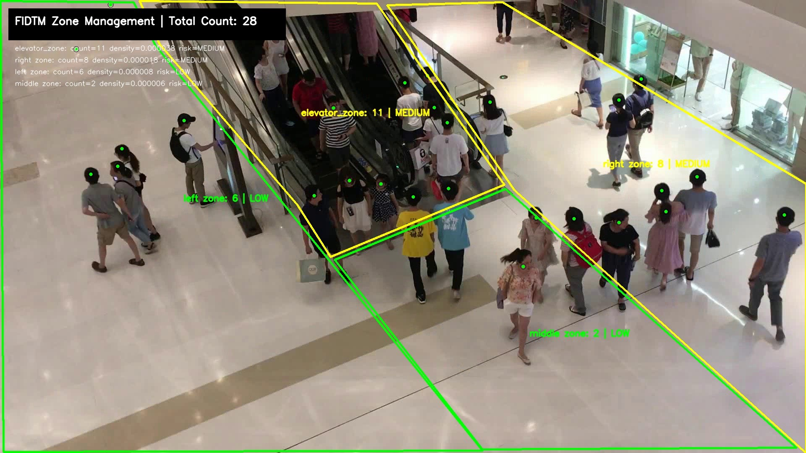
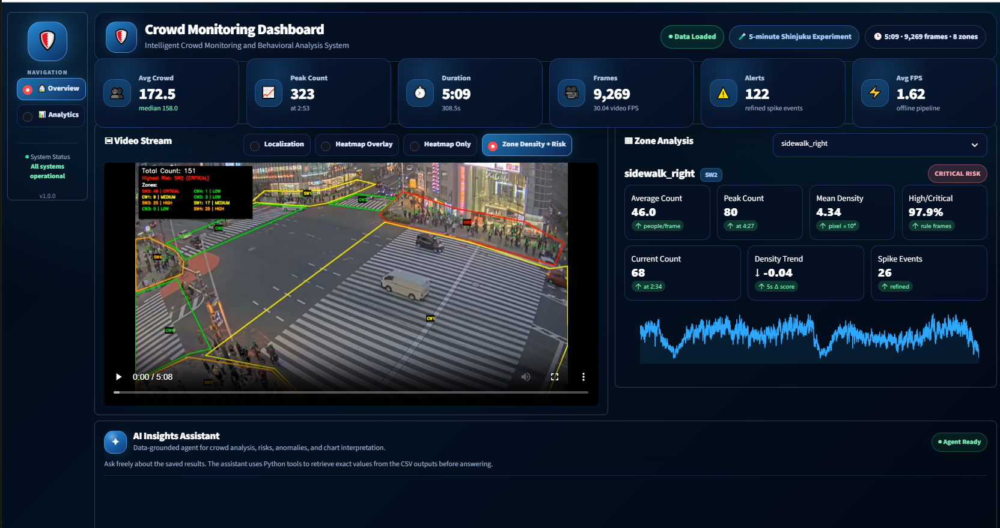
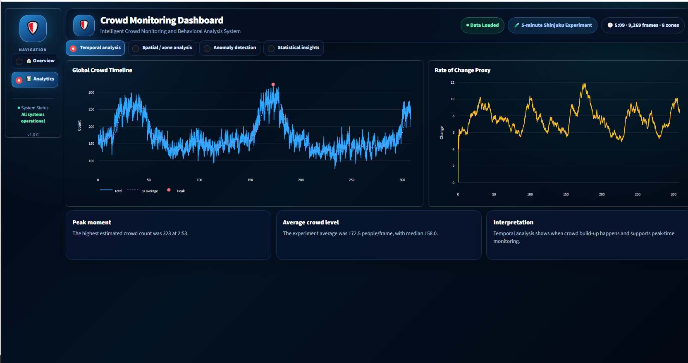
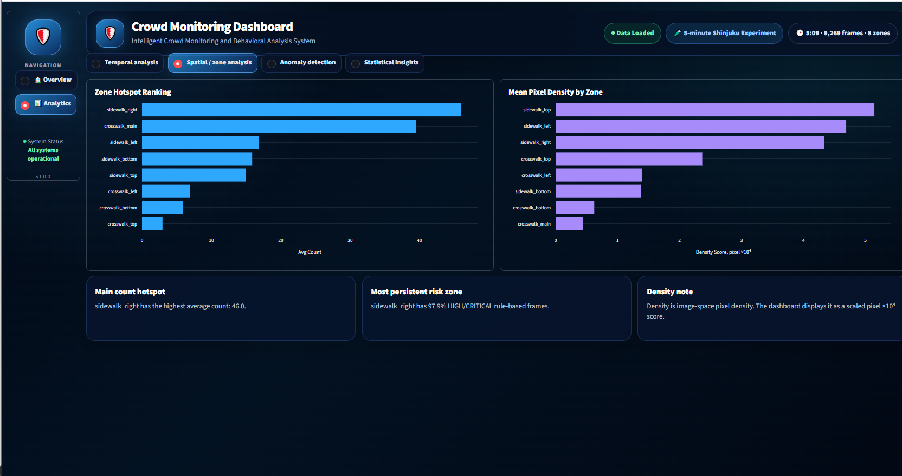
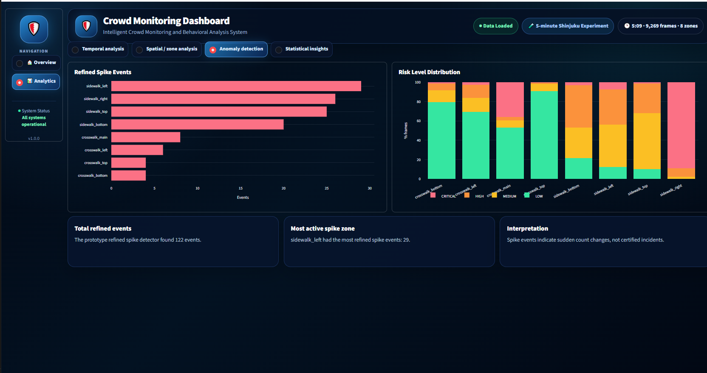
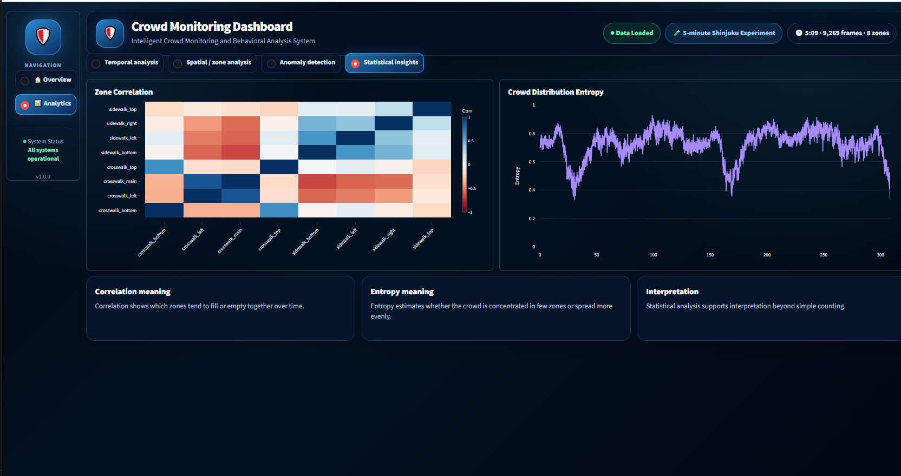
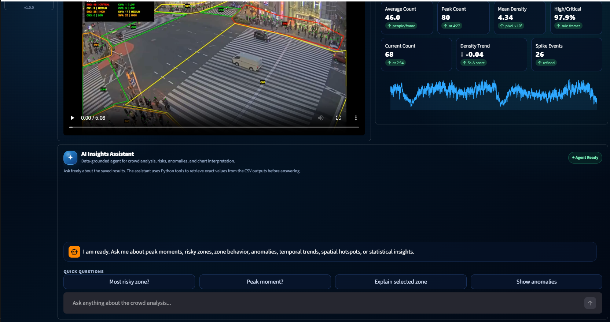

# Crowd Analysis System


An intelligent crowd monitoring and behavioral analysis system that turns CCTV-style
video into structured, visual, and explainable crowd intelligence — moving beyond a
simple global head count toward **zone-level monitoring and decision support**.

Bachelor Thesis · German University in Cairo (GUC) · 2026
Author: **Yahia El Gayar** · Supervisor: **Dr. Rimon Elias**

<!-- Hero: full pipeline output (localization, heatmap, heatmap-only, zone risk) -->


> One frame, four views: FIDTM localization, heatmap overlay, heatmap-only, and zone density + risk.

---

## Table of Contents

- [Overview](#overview)
- [Key Features](#key-features)
- [Screenshots](#screenshots)
- [Reference Run](#reference-run)
- [How It Works](#how-it-works)
- [Model Selection](#model-selection-summary)
- [Risk Thresholds](#risk-thresholds)
- [Project Structure](#project-structure)
- [Installation](#installation)
- [Configuration](#configuration)
- [Usage](#usage)
- [The Dashboard](#the-dashboard)
- [AI Assistant](#ai-assistant)
- [Generated Outputs](#generated-outputs)
- [Limitations](#limitations)
- [Future Work](#future-work)
- [Tech Stack](#tech-stack)
- [Acknowledgments](#acknowledgments)
- [License](#license)

---

## Overview

Most surveillance systems only record video for a human to watch. They do not tell you
**how many** people are present, **where** the crowd is forming, or **which** areas need
attention. This project closes that gap.

It takes a recorded video, locates every person using a deep-learning crowd-localization
model (**FIDTM**), assigns each detected head to a manually drawn polygon **zone**, and
then builds a full analytics and reporting layer on top: heatmaps, per-zone density and
risk levels, temporal and spatial analytics, anomaly/spike detection, a **Streamlit
dashboard**, and a **data-grounded AI assistant** that answers questions in plain language
from the exported results.

> The system is built for **offline post-processing** of saved surveillance video.
> It is a research prototype and decision-support tool, not a certified real-time
> CCTV safety system.

---

## Key Features

- **Crowd localization** — FIDTM detects an exact head point for every person, frame by frame.
- **Heatmaps** — overlay and heatmap-only views show where the crowd concentrates.
- **Zone analysis** — polygon zones (drawn once in LabelMe) with point-in-polygon assignment.
- **Density & risk** — per-zone count, relative density, and a four-level risk label
  (LOW / MEDIUM / HIGH / CRITICAL).
- **Refined analytics** — temporal trends, spatial hotspots, spike detection, zone
  correlation, and crowd-distribution entropy.
- **Streamlit dashboard** — KPI cards, output videos, zone analysis, and analytics charts.
- **AI assistant** — a data-grounded agent that answers questions from the exported CSVs,
  with a deterministic rule-based fallback when no AI model is available.

---

## Screenshots

**Crowd localization** — FIDTM marks an exact head point for every person, frame by frame,
holding up even in dense crowds:



**Zone density & risk** — each detected head is assigned to a polygon zone, and every zone
gets a count, a relative density, and a four-level risk label:



---

## Reference Run

The system is demonstrated on a 5-minute Shinjuku crossing video:

| Property | Value |
| --- | --- |
| Footage | ~5 minutes (Shinjuku crossing, CCTV-style) |
| Frames processed | 9,269 |
| Zones | 8 (sidewalks and crosswalks) |
| Crowd range | 76 – 323 people per frame |
| Peak | 323 people at 2:53 |

---

## How It Works

The pipeline runs in three stages.

**A. Capture & Setup** (once, offline)

1. Record a CCTV-style video clip.
2. Extract the first frame and draw meaningful zones by hand in LabelMe (saved as JSON polygons).

**B. Process** (Kaggle GPU)

1. FIDTM runs frame-by-frame across the whole recording.
2. It emits 4 annotated videos + 2 CSV data files.

**C. Analyze & Present** (local — VSCode + Streamlit)

1. Four analytics layers are computed from the CSVs.
2. A Streamlit dashboard and AI assistant present and explain the results.

```
Video frame
   --> FIDTM inference (count + head points)
   --> Heatmaps
   --> Zone assignment (point-in-polygon)
   --> Per-zone count, density, risk
   --> CSV logging
   --> Refined analytics (temporal / spatial / spike / correlation + entropy)
   --> Streamlit dashboard + AI assistant
```

---

## Model Selection (Summary)

Three stages of experiments led to the final model:

1. **Detector-based (YOLOv8 + ByteTrack, SAHI, YOLO-CROWD)** — accurate in sparse scenes,
   but failed in dense crowds (merged boxes, split detections, missed far-away people).
2. **Point-localization exploration (P2PNet, APGCC, IIM)** — right output type, but blocked
   by missing pretrained weights, cross-scene instability, or outdated repositories.
3. **Final benchmark (FIDTM vs PET vs STEERER)** on FDST and Mall — FIDTM was selected for
   its consistent cross-scene performance and explicit head-point output.

**Final benchmark (FIDTM):**

| Dataset | MAE | RMSE | F1 |
| --- | --- | --- | --- |
| FDST | 3.6135 | 4.7366 | 0.7346 |
| Mall | 3.1670 | 3.9379 | 0.6983 |

---

## Risk Thresholds

Per-zone risk is assigned from the zone count using configurable thresholds:

| Risk Level | Rule |
| --- | --- |
| LOW | count < 8 |
| MEDIUM | 8 – 17 |
| HIGH | 18 – 29 |
| CRITICAL | >= 30 |

---

## Project Structure

```
Crowd_Analysis_System/
├── config/                 # Pipeline config, risk thresholds, zone polygon JSON
├── data/
│   ├── raw/                # Input videos and annotation frames
│   └── sample_videos/
├── notebooks/              # Kaggle notebooks (benchmark, finetuning, video pipeline)
├── results/
│   ├── analysis_5min_refined/   # Refined analytics: tables, figures, insights
│   ├── benchmark/               # Benchmark CSVs and final per-frame / per-zone outputs
│   ├── videos/                  # Output videos (localization, heatmaps, zone risk)
│   └── videos_dashboard/        # Dashboard-ready videos
├── src/
│   ├── models/             # FIDTM inference wrapper
│   ├── pipeline/           # Zone manager, risk classifier, video processing, analytics
│   ├── visualization/      # Drawing utilities and heatmap generation
│   ├── dashboard/          # Streamlit dashboard app, charts, data loader
│   ├── agent/              # AI assistant (agent, prompts, tools)
│   ├── tracking/           # Experimental tracking scripts (not finalized)
│   └── utils/              # Config loader, video utilities
├── tests/                  # Unit tests
├── tools/                  # Helper scripts (frame extraction, video conversion)
├── requirements.txt
└── README.md
```

---

## Installation

**Requirements:** Python 3.10+ and (for inference) an NVIDIA GPU with CUDA. The dashboard
and analytics run on CPU.

```bash
# 1. Clone the repository
git clone https://github.com/Yahiaelgayarrr/Crowd_Analysis_System.git
cd Crowd_Analysis_System

# 2. (Recommended) create a virtual environment
python -m venv venv
# Windows
venv\Scripts\activate
# macOS / Linux
source venv/bin/activate

# 3. Install dependencies
pip install -r requirements.txt
```

---

## Configuration

The AI assistant can optionally use an LLM (Gemini or OpenAI). Create a `.env` file in the
project root:

```env
# Choose a provider: gemini | openai | rule | auto
CROWD_AGENT_PROVIDER=gemini

# Provide the key for your chosen provider
GOOGLE_API_KEY=your_gemini_key_here
# OPENAI_API_KEY=your_openai_key_here

# Optional
CROWD_AGENT_DEBUG=0
```

> **Do not commit `.env`** — it is listed in `.gitignore`. If no key is provided, the
> assistant automatically uses the deterministic rule-based fallback.

---

## Usage

### 1. Annotate zones (once per camera)

Extract the first frame and draw polygon zones in LabelMe, then save the JSON into
`config/`.

```bash
python tools/extract_first_frame.py --video data/raw/demo_video.mp4
# then open the frame in LabelMe and save zones as JSON
```

### 2. Run the FIDTM video pipeline

Processes the video and produces the annotated videos and CSV outputs.

```bash
python -m src.pipeline.run_pipeline
```

### 3. Compute the refined analytics

Builds temporal, spatial, anomaly, correlation, and entropy outputs from the two CSVs.

```bash
python -m src.pipeline.run_analysis_5min
```

### 4. Launch the dashboard

```bash
streamlit run src/dashboard/app.py
# or, if the streamlit command is not on your PATH:
python -m streamlit run src/dashboard/app.py
```

Then open the local URL shown in the terminal (typically `http://localhost:8501`).

---

## The Dashboard

**Overview page** — KPI cards (average crowd, peak count, duration, frames, alerts, FPS),
a switchable video player (localization, heatmap overlay, heatmap only, zone density + risk),
a per-zone analysis panel, and the AI assistant.



**Analytics page** — four tabs:

| Layer | Shows | Why it matters |
| --- | --- | --- |
| Temporal | Crowd count over time + rate of change | **When** the crowd builds up |
| Spatial | Zone hotspot ranking + density by zone | **Where** the crowd concentrates |
| Anomaly | Spike events + risk distribution | Sudden build-ups and chronically busy zones |
| Statistical | Zone correlation + crowd entropy | How zones relate and when the crowd concentrates |

*Temporal — global crowd timeline and rate of change:*



*Spatial — zone hotspot ranking and mean pixel density per zone:*



*Anomaly — refined spike events and per-zone risk distribution:*



*Statistical — zone correlation matrix and crowd-distribution entropy:*



---

## AI Assistant

A data-grounded assistant that answers natural-language questions using the exported CSV
statistics — it never guesses from raw video. Python tools first extract the exact values
needed for a question, then the model explains them.

It can answer:

- Exact single frames — *"what was each zone in the first frame?"*, *"frame 5186"*
- Averaged windows — *"first minute"*, *"last 30 seconds"*, *"whole video"*
- Specific timestamps — *"at 1:00, list every zone"*
- Risk, peaks, anomalies, temporal/spatial/statistical insights
- Zone explanations and comparisons
- Evidence-backed monitoring recommendations
- Plain-language explanations of every analytics chart

If the LLM is unavailable, a **rule-based fallback** answers the most important factual
questions deterministically from the CSVs.



---

## Generated Outputs

| Output | Purpose |
| --- | --- |
| Localization video | Head points + running count |
| Heatmap videos | Crowd concentration (overlay and heatmap-only) |
| Zone-risk video | Per-zone count, density, and risk |
| CSV files | Frame-level and zone-level statistics |
| Refined analytics | Temporal, spatial, spike, correlation, entropy |
| Dashboard + AI | Presentation and explanation layer |

---

## Limitations

This is a research prototype built for offline analysis:

1. **Not real-time yet** — FIDTM is heavy (~1.62 FPS on a Kaggle GPU).
2. **Manual zone setup** — polygons are drawn by hand, once per camera.
3. **Relative density** — measured in image space, not real-world persons/m² (no camera calibration).
4. **Threshold-based risk** — risk levels come from configurable thresholds, not validated against real incidents.
5. **Data-aware AI** — the assistant reads exported statistics; it does not watch the video.

---

## Future Work

- **Finetune** FIDTM on a labelled domain dataset to sharpen accuracy.
- **Real-time deployment** via TensorRT, quantization, frame skipping, and lower resolution
  to reach 10–15 FPS.
- **Tracking** (DeepSORT / BoT-SORT) for persistent identities, dwell time, and flow.
- **Optical flow** to capture movement direction (entering vs leaving, bottlenecks).
- **Learned anomaly detection** from historical patterns instead of fixed thresholds.
- **Camera calibration** (homography) for real persons/m² density.
- **Automatic zone detection** and **multi-camera** support with a video-aware assistant.

---

## Tech Stack

Python · PyTorch · FIDTM · OpenCV · LabelMe · Streamlit · pandas · NumPy · Matplotlib ·
Gemini / OpenAI (optional, for the AI assistant)

---

## Acknowledgments

Special thanks to **Dr. Rimon Elias** for his supervision and guidance, and to the Media
Engineering and Technology Department at the German University in Cairo.

This thesis builds on the FIDTM crowd-localization model and the FDST and Mall benchmark
datasets; full references are provided in the thesis document.

---

## License

Released under the [MIT License](LICENSE). Developed as a Bachelor thesis at the German
University in Cairo (2026) — you are welcome to use, modify, and build on it with attribution.